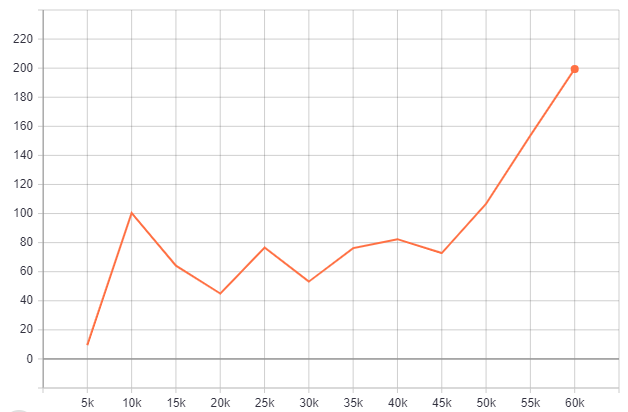

# Deep Q-Network

## Summary
This repo contains my implementation of a [deep Q-network](https://web.stanford.edu/class/psych209/Readings/MnihEtAlHassibis15NatureControlDeepRL.pdf) (DQN).

DQN is a method of solving the reinforcement learning problem. It approximates the optimal Q-function using a deep neural network.

## Running the code
Check if you have the requirements listed in `requirements.txt` installed. If not, make a fresh conda environnment with Python 3.7, then run `pip install -r requirements.txt`.

Now you can run `python main.py` to train DQN in [CartPole-v0](https://github.com/openai/gym/wiki/CartPole-v0), an [OpenAI Gym](https://gym.openai.com/) environment.

## Results
DQN should learn a good policy after about 60k steps, giving a graph of mean episode return against training step that looks like this:

## Training with different environments and hyperparameters
DQN only works in environments with discrete action spaces. My default hyperparameters will probably result in efficient training in  the CartPole environment only. With those caveats, you can train this implementation of DQN in any [OpenAI Gym classic control environment](https://gym.openai.com/envs/#classic_control). For example, to train in the Acrobot-v1 environment, run `python main.py --env_ID Acrobot-v1`.

Hyperparameters can be set via the command line, e.g. `python main.py --env_ID Acrobot-v1 --target_update_period 100`. See [`arg_setting.py`](./arg_setting.py) for the hyperparameters that DQN takes.
